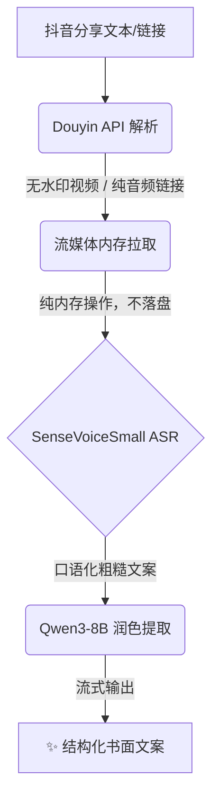

# 🎙️ DouyinParsing (抖音音视频解析与文案提取)

[](https://github.com/Evil0ctal/Douyin_TikTok_Download_API)
[](https://www.python.org/downloads/)
[](https://opensource.org/licenses/MPL-2.0)

> 🚀 一个极简、高效的抖音音视频解析与文案提取工具。
> 通过一键解析无水印视频/音频，结合最前沿的 AI 语音识别与大语言模型，自动生成**分段清晰、标点准确的书面级文案**。

---

## ✨ 核心特性

- **⚡ 极速解析**：底层依赖强大的 [Douyin_TikTok_Download_API](https://github.com/Evil0ctal/Douyin_TikTok_Download_API)，智能提取纯音频或无水印视频，最大化节省带宽与时间。
- **🧠 智能识别 (ASR)**：接入硅基流动提供的 `FunAudioLLM/SenseVoiceSmall`，识别速度极快，自带标点支持，应对复杂口播毫无压力。
- **📝 极致润色 (LLM)**：搭载 `Qwen/Qwen3-8B` 大模型，不仅能去除口语化废话（“呃”、“那个”、“对吧”），还能根据逻辑自动进行**合理的段落切分**。
- **🌊 流式输出**：大模型润色阶段全面采用 **SSE 流式输出**（Streaming），边生成边渲染，彻底告别长视频（万字文案）带来的超时报错与漫长等待。
- **☁️ Serverless 体验**：支持通过 **GitHub Actions + Issues** 实现零服务器成本的在线云端调用。

---

## 🛠️ 工作流架构



---

## 🚀 快速开始

### 方式一：GitHub Issues 云端调用 (推荐 🌟)

你可以把这个项目当成一个**免费的聊天机器人**，直接在 GitHub Issues 里提交链接，机器人会自动回复文案结果！不仅无需配置本地环境，还不占用任何本地资源。

1. **Fork 本仓库** 到你的 GitHub 账号下。
2. 在仓库的 `Settings -> Secrets and variables -> Actions` 中，点击 `New repository secret`，添加 `SILICONFLOW_API_KEY`，值为你的硅基流动 API Key。
3. **注入抖音 Cookie**（用于内部拉起 Docker 解析服务，绕过公共 API 限速）：
   - 电脑浏览器无痕模式打开 [抖音网页版](https://www.douyin.com)，按 `F12` 开启开发者工具。
   - 切换到 `Network` 标签页，刷新页面，随意选中一条网络请求。
   - 在 `Headers` → `Request Headers` 找到 `Cookie` 字段，**完整复制**其内容。
   - 返回仓库 `Secrets`，添加名为 `DOUYIN_COOKIE` 的环境变量并粘贴。
   - *⚠️ 注：Cookie 具有时效性，若遇到解析失败请尝试重新获取更新。*
4. 在仓库顶部导航栏点击 **Issues**，创建一个 **New issue**。
5. 将抖音分享文本/链接写在 Issue 标题或正文，点击 **Submit new issue**。
6. 喝口水 ☕，几秒钟后，GitHub Actions Bot 就会把排版精美的文案回复在评论区！

### 方式二：本地调用

如果你希望进行二次开发或本地测试，只需安装 Python 3.10+ 及依赖即可快速运行体验：

```bash
# 1. 安装依赖
pip install requests

# 2. 将硅基流动的 API Key 配置进环境变量 SILICONFLOW_API_KEY
# Windows PowerShell:
$env:SILICONFLOW_API_KEY="你的API_Key"
# Linux / macOS:
export SILICONFLOW_API_KEY="你的API_Key"

# 3. 运行默认测试链接
python main.py

# 4. 或附加你自己的抖音分享文本/链接
python main.py "在这里粘贴你的分享文本或链接"
```

> 💡 **提示**：生成的 ASR 原文会保存在 `transcript.txt`，润色后的最终文案保存在 `polished.txt` 中。

---

## 🗺️ 演进路线图 (Roadmap)

- [x] **解决长文本超时**：已引入流式请求机制（Stream），解除硬编码超时限制。
- [x] **文案排版优化**：已在 LLM Prompt 中强制规定空行分段（`\n\n`）并优化输出格式。
- [ ] **超长视频支持 (Chunking)**
  - 智能文件落盘检测：视频超出 20MB 时启用临时落盘。
  - 音频切片：利用 `pydub` 等工具，自动将超长音频切分成 10 分钟片段进行分布式解析。
- [ ] **深度内容理解**
  - 不仅限于文案润色，后续将支持提取核心要点、总结视频主旨、生成思维导图结构（Markdown 列表）。
- [ ] **外挂字幕融合**
  - 尝试抓取抖音原生 CC 字幕文件，将其作为 Context 与语音识别结果交叉对比，实现极限准确率的润色。

---