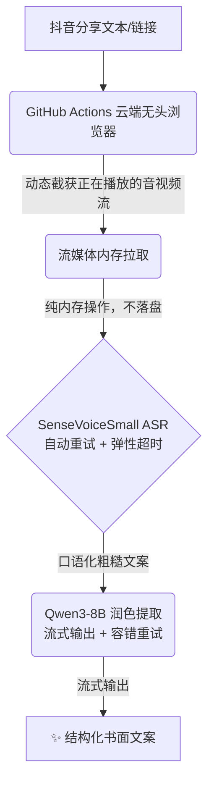

# 🎙️ DouyinParsing (抖音音视频解析与文案提取)

[](https://www.python.org/downloads/)
[](https://opensource.org/licenses/MPL-2.0)

> 🚀 一个极简、高效的抖音音视频解析与文案提取工具。
> 通过一键解析无水印视频/音频，结合最前沿的 AI 语音识别与大语言模型，自动生成**分段清晰、标点准确的书面级文案**。

---

## ✨ 核心特性

- **⚡ 动态截流解析**：基于无头浏览器与网络流量拦截机制，模拟移动端环境直接捕获原生音视频流，彻底摆脱传统爬虫 API 对反爬逆向的依赖，无惧平台接口变更。
- **🧠 智能识别 (ASR)**：接入硅基流动提供的 `FunAudioLLM/SenseVoiceSmall`，识别速度极快，自带标点支持，应对复杂口播毫无压力。
- **📝 极致润色 (LLM)**：搭载 `Qwen/Qwen3-8B` 大模型，不仅能去除口语化废话（“呃”、“那个”、“对吧”），还能根据逻辑自动进行**合理的段落切分**。
- **🌊 流式输出与重试容错**：大模型润色阶段全面采用 **SSE 流式输出**（Streaming）；ASR 与 LLM 全链路配置**弹性超时与指数退避自动重试**（默认 3 次），彻底告别长音频或跨国网络延迟带来的超时报错与单次中断。
- **☁️ Serverless 体验**：支持通过 **GitHub Actions + Issues** 实现零服务器成本的在线云端调用。

---

## 🛠️ 工作流架构


```mermaid
graph TD
    A[抖音分享文本/链接] --> B(GitHub Actions 云端无头浏览器)
    B -->|动态截获正在播放的音视频流| C(流媒体内存拉取)
    C -->|纯内存操作，不落盘| D{SenseVoiceSmall ASR<br/>自动重试 + 弹性超时}
    D -->|口语化粗糙文案| E(Qwen3-8B 润色提取<br/>流式输出 + 容错重试)
    E -->|流式输出| F[✨ 结构化书面文案]
```

---

## 🚀 快速开始

### 方式一：GitHub Issues 云端调用 (推荐 🌟)

你可以把这个项目当成一个**免费的聊天机器人**，直接在 GitHub Issues 里提交链接，机器人会自动回复文案结果！不仅无需配置本地环境，还不占用任何本地资源。

1. **Fork 本仓库** 到你的 GitHub 账号下。
2. **开启前置开关（仅需配置一次，GitHub 默认对 Fork 仓库关闭以下功能）**：
   - **开启 Issues 功能**：进入 Fork 后的仓库 -> 点击顶部 **Settings** -> 在 **General** 页面向下滚动到 **Features** 区域 -> 勾选 **Issues**（否则顶部不会显示 Issues 标签页）。
   - **启用 GitHub Actions**：点击仓库顶部的 **Actions** 标签页 -> 点击绿色的 **"I understand my workflows, go ahead and enable them"** 启用工作流。
   - **授予 Actions 写入权限**：进入 **Settings** -> 左侧菜单点击 **Actions** -> **General** -> 页面滚动到底部 **Workflow permissions** -> 选择 **Read and write permissions** 并点击 **Save**（确保机器人有权限在 Issue 下发表回复）。
3. 在仓库的 `Settings -> Secrets and variables -> Actions` 中，点击 `New repository secret`，添加 `SILICONFLOW_API_KEY`，值为你的硅基流动 API Key。
   - *(可选)* 添加 `SILICONFLOW_TIMEOUT`（默认为 `180` 秒），针对超长音频或海外网络可配置为 `240` 或 `300`。
4. **(可选) 注入抖音 Cookie**（默认无需配置，开箱即用）：
   - 本项目默认以高仿移动端 Safari/微信环境运行，游客身份即可直接拦截大部分公开视频流。
   - 若遇到部分作品提示验证，或为了更强的防风控稳定性，可添加名为 `DOUYIN_COOKIE` 的 Secret。
   - 获取方式：电脑浏览器打开 [抖音网页版](https://www.douyin.com)，按 `F12` 开启开发者工具，在 `Network` 请求头中复制 `Cookie` 内容粘贴至 Secret。
5. 在仓库顶部导航栏点击 **Issues**，创建一个 **New issue**。
6. 将抖音分享文本/链接写在 Issue 标题或正文，点击 **Submit new issue**。
7. 喝口水 ☕，十几秒后，GitHub Actions Bot 就会把排版精美的文案回复在评论区！

### 方式二：本地调用

如果你希望进行二次开发或本地测试，只需安装 Python 3.10+ 及依赖即可快速运行体验：

```bash
# 1. 安装依赖与浏览器内核
pip install requests playwright
playwright install chromium

# 2. 将硅基流动的 API Key 配置进环境变量 SILICONFLOW_API_KEY
# Windows PowerShell:
$env:SILICONFLOW_API_KEY="你的API_Key"
# 可选：配置超时时间（默认 180 秒）
# $env:SILICONFLOW_TIMEOUT="180"

# Linux / macOS:
export SILICONFLOW_API_KEY="你的API_Key"
# 可选：配置超时时间（默认 180 秒）
# export SILICONFLOW_TIMEOUT="180"

# 3. 运行默认测试链接
python main.py

# 4. 或附加你自己的抖音分享文本/链接
python main.py "在这里粘贴你的分享文本或链接"
```

> 💡 **提示**：生成的 ASR 原文会保存在 `transcript.txt`，润色后的最终文案保存在 `polished.txt` 中。

---

## 🗺️ 演进路线图 (Roadmap)

- [x] **解决长文本超时**：已引入流式请求机制（Stream），解除硬编码超时限制。
- [x] **文案排版优化**：已在 LLM Prompt 中强制规定空行分段（`\n\n`）并优化输出格式。
- [ ] **超长视频支持 (Chunking)**
  - 智能文件落盘检测：视频超出 20MB 时启用临时落盘。
  - 音频切片：利用 `pydub` 等工具，自动将超长音频切分成 10 分钟片段进行分布式解析。
- [ ] **深度内容理解**
  - 不仅限于文案润色，后续将支持提取核心要点、总结视频主旨、生成思维导图结构（Markdown 列表）。
- [ ] **外挂字幕融合**
  - 尝试抓取抖音原生 CC 字幕文件，将其作为 Context 与语音识别结果交叉对比，实现极限准确率的润色。
  - 尝试视频字幕 OCR
- [ ] **浏览器插件**
  - 自建 Douyin_TikTok_Download_API 服务
  - 将 main.py 改造成浏览器插件

---